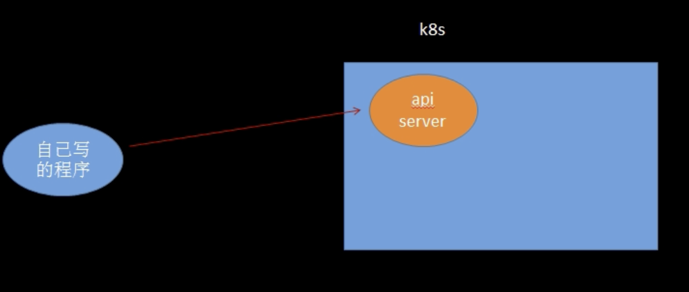

# command


## Pod


### 创建pod


```yaml
apiVersion: v1
kind: Pod
metadata:
  name: myngxpod
spec:
  containers:
  - name: ngx
    image: "nginx:1.18-alpine"
```


`kubectl apply -f myngxpod.yaml`


* 查看pod详情

```bash
kubectl  describe pod myngxpod

# IP:           10.244.1.5
# IPs:
  #  IP:  10.244.1.5
curl 10.244.1.5
> <h1>Welcome to nginx!</h1>   done!!!


kubectl logs podname # 查看日志

kubectl exec -it  podname  -- sh // 进入pod

kubectl delete pod podname // 删除 pod
```


### 创建多容器pod


```yaml
apiVersion: v1
kind: Pod
metadata:
  name: myngxpod2
spec:
  containers:
  - name: ngx
    image: "nginx:1.18-alpine"
  - name: alpine
  	image: "alpine:3.12"
```


```bash
# 查看多容器pod日志
[root@xxx1 yamls]# kubectl logs myngxpod
error: a container name must be specified for pod myngxpod, choose one of: [ngx alpine]
[root@xxx1 yamls]# kubectl logs myngxpod alpine
this is second
[root@xxx1 yamls]# kubectl logs myngxpod ngx
/docker-entrypoint.sh: /docker-entrypoint.d/ is not empty, will attempt to perform configuration
/docker-entrypoint.sh: Looking for shell scripts in /docker-entrypoint.d/
...
```


```bash
# 进入多容器pod
kubectl exec -it myngxpod -c alpine -- sh
```


### 配置数据卷：挂载主机目录


```yaml
apiVersion: v1
kind: Pod
metadata:
  name: myngxpod
spec:
  containers:
  - name: ngx
    image: "nginx:1.18-alpine"
    volumeMounts:
    - name: mydata
      mountPath: /data
  - name: alpine
    command: ["sh","-c","echo this is second && sleep 36000"]
    image: "alpine:3.12"
  volumes:
  - name: mydata
    hostPath: 
      path: /root/data
      type: Directory
```

volumeMounts   代表挂载

mountPath          代表要挂载的目录


* 验证

```bash
[root@z1 yamls]# kubectl exec -it myngxpod -c ngx -- sh
/ # ls
bin                   docker-entrypoint.d   home                  mnt                   root                  srv                   usr
data                  docker-entrypoint.sh  lib                   opt                   run                   sys                   var
dev                   etc                   media                 proc                  sbin                  tmp
/ # cd data/
/data # ls
log.txt
/data # cat log.txt 
123
/data # 
```


## deployment


### pod 和 deployment基本区别，创建deployment

Pods:


1. 运行一组容器，适合一次性开发
2. 很少直接用于生产


Deployment


1. 运行一组相同的Pod（副本水平扩展），滚动更新
2. 适合生产


总结为： Deployment 通过副本集管理和创建POD


### 创建dep


```yaml
apiVersion: apps/v1
kind: Deployment
metadata:
  name: myngxdep
spec:
  selector:
    matchLabels:
      app: nginx
  replicas: 1
  template:
    metadata:
      labels:
        app: nginx
    spec:
      containers:
        - name: ngx
          image: "nginx:1.18-alpine"
          imagePullPolicy: IfNotPresent

```


### 两个容器共享一个文件夹

* 这个文件夹在 虚拟机节点哪里？


关键点


```yaml
volumes:
- name: sharedata
	emptyDir: {}
```


同一个pod内 的容器都能读写 EmptyDir 中文件。 常用于临时空间、 多容器共享，如日志或者 tmp 文件需要的临时目录


```yaml
apiVersion: apps/v1
kind: Deployment
metadata:
  name: myngxdep
spec:
  selector:
    matchLabels:
      app: nginx
  replicas: 1
  template:
    metadata:
      labels:
        app: nginx
    spec:
      containers:
        - name: ngx
          image: "nginx:1.18-alpine"
          imagePullPolicy: IfNotPresent
          volumeMounts:
            - name: sharedata
              mountPath: /data
        - name: alpine
          image: "alpine:3.12"
          imagePullPolicy: IfNotPresent
          command: ["sh", "-c", "echo this is second && sleep 36000"]
          volumeMounts:
            - name: sharedata
              mountPath: /data
      volumes:
        - name: sharedata
          emptyDir: {}

```


`kubectl exec -it myngxdep-65b9fdddf-jmz7x  -c alpine -- sh`

在两个容器里面 都能找到 /data 文件夹


### init容器的基本使用


> 有些时候，pod 之间的启动 是需要添加依赖关系的；比如a容器启动依赖b容器，如果b 容器没有启动完成，那么就没有启动a 容器的必要；


init容器是一种特殊容器，在Pod内的应用容器启动之前运行，Init容器可以包括一些应用镜像中不存在的使用工具和安装脚本；


init容器与普通的容器非常像，除了如下两点：

​	它们总是运行到完成；

​	每个都必须在下一个启动之前成功完成；


如果Pod的init 容器失败，kubelet会不断重启该init 容器直到该容器成功为止； 然而，如果Pod 对应的restartPlicy值 为“Never”, k8s不会重新启动Pod


基本配置


```yaml
initContainers:
	- name: init-mydb
		image: alpine:3.12
		command: ['sh','-c','echo wait for db && sleep 35 && echo done']
```


* 具体场景

1. 譬如ping db
2. 譬如控制服务启动顺序


```bash
NAME                        READY   STATUS     RESTARTS   AGE
myngxdep-665684b59d-94wrt   0/2     Init:0/1   0          7s

# kubectl logs myngxdep-665684b59d-94wrt init-mydb
wait for db
done

可以看出 init 容器已经完成了
# kubectl get pods
NAME                        READY   STATUS    RESTARTS   AGE
myngxdep-665684b59d-94wrt   2/2     Running   0          2m42s
```


## configMap

> 基本创建、环境变量引用


configMap 是一种api 对象，用来将非机密性的数据保存到键值中，使用时可以用作环境变量、命令行参数或者存储卷中的配置文件；

configmap 将您的环境配置信息和容器镜像解耦，便于应用配置的修改，当您需要储存机密信息时可以使用secret对象；


### 使用的四个场景

1. 容器entrypoint 的命令行参数
2. 容器的环境变量
3. 映射成文件
4. 编写代码在pod中运行，使用k8s Api 来读取 ConfigMap（重）
   1. ingress， nginx-ingress-controller  nginx -s reload


### 操作命令


```bash
$> kubectl get configmap
$> kubectl get cm
```


### 创建一个cm


```bash
apiVersion: v1
kind: ConfigMap
metadata:
  name: mycm
data:
  # 每一个键对应一个简单的值，以字符串的形式体现
  username: "alex"
  userage: "19"
```


```bash
# kubectl get cm
NAME               DATA   AGE
kube-root-ca.crt   1      7d21h
mycm               2      21s
```


```bash
# kubectl describe cm mycm
Name:         mycm
Namespace:    default
Labels:       <none>
Annotations:  <none>

Data
====
userage:
----
19
username:
----
alex

BinaryData
====

Events:  <none>
```


#### 另一种格式

```yaml
apiVersion: v1
kind: ConfigMap
metadata:
  name: mycm
data:
  # 每一个键对应一个简单的值，以字符串的形式体现
  username: "alex"
  userage: "19"
  user.info: |
    name=leo
    name=20
```


```bash
# kubectl describe cm mycm
Name:         mycm
Namespace:    default
Labels:       <none>
Annotations:  <none>

Data
====
user.info:
----
name=leo
name=20

userage:
----
19
username:
----
alex

BinaryData
====

Events:  <none>
```


### 作为环境变量来使用


```yaml
apiVersion: apps/v1
kind: Deployment
metadata:
  name: myngxdep
spec:
  selector:
    matchLabels:
      app: nginx
  replicas: 1
  template:
    metadata:
      labels:
        app: nginx
    spec:
      containers:
        - name: ngx
          image: "nginx:1.18-alpine"
          imagePullPolicy: IfNotPresent
          env:
            - name: TEST
              value: testvalue
            - name: USER_NAME
              valueFrom:
                configMapKeyRef:
                  name: mycm # ConfigMap的名称
                  key: username # 需要取的值

```


```bash
# kubectl exec -it myngxdep-795685d8f7-7zq6p -- sh
/ # echo $TEST
testvalue
/ # echo $USER_NAME
alex

#done!!
```

### 映射成单文件

```yaml
apiVersion: apps/v1
kind: Deployment
metadata:
  name: myngxdep
spec:
  selector:
    matchLabels:
      app: nginx
  replicas: 1
  template:
    metadata:
      labels:
        app: nginx
    spec:
      containers:
        - name: ngx
          image: "nginx:1.18-alpine"
          imagePullPolicy: IfNotPresent
          volumeMounts:
            - name: cmdata
              mountPath: /data
          env:
            - name: TEST
              value: testvalue
            - name: USER_NAME
              valueFrom:
                configMapKeyRef:
                  name: mycm # ConfigMap的名称
                  key: username # 需要取的值
      volumes:
        - name: cmdata
          configMap:
            name: mycm
            items:
              - key: user.info
                path: user.txt
```


```bash
# 验证

# kubectl exec -it myngxdep-5989bc65d8-2jhqw -- sh
/ # ls
bin                   docker-entrypoint.sh  media                 root                  sys
data                  etc                   mnt                   run                   tmp
dev                   home                  opt                   sbin                  usr
docker-entrypoint.d   lib                   proc                  srv                   var
/ # cd data/
/data # ls
user.txt
/data # cat user.txt 
name=leo
name=20
/data # 
```


### 全部映射文件和subpath


上面映射单文件时候

```yaml
  items:
    - key: user.info
    path: user.txt
```

指定了 key 为 user.info， 如何不指定key， 也想挂载其中一个配置


* 用于指定所引用的卷内的子路径，而不是其根路径


其实只是换了一种写法


```yaml
apiVersion: apps/v1
kind: Deployment
metadata:
  name: myngxdep
spec:
  selector:
    matchLabels:
      app: nginx
  replicas: 1
  template:
    metadata:
      labels:
        app: nginx
    spec:
      containers:
        - name: ngx
          image: "nginx:1.18-alpine"
          imagePullPolicy: IfNotPresent
          volumeMounts:
            - name: cmdata
              mountPath: /data/user.txt  # 这里直接定死路径文件
              subPath: user.info  # subPath 指的是下面 mycm的 子路径
      volumes:
        - name: cmdata
          configMap:
          	defaultMode: 0655
            name: mycm
     
```


### 用程序读取（体外）




```
clientSet.CoreV1().ConfigMaps("default").Get(context.Background(), "mycm", v1.GetOptions{})
```


### 用程序读取 （体内）


因为体外调用可以用proxy，那体内的话，业务调用其实并没有区别，区别在于如何透过权限体系；来达到访问apiserver的 能力；


### 调用API监控cm的变化

```go
type CmHandler struct{}
func(this *CmHandler) OnAdd(obj interface{}){}
func(this *CmHandler) OnUpdate(oldObj, newObj interface{}){
  if newObj.(*v1.ConfigMap).Name == "mycm" {
    log.Println("mycm 发生了变化")
  }
}
func(this *CmHandler) OnDelete(oldObj, newObj interface{})

fact:= informers.NewSharedInfomerFactory(getClient(), 0)
cmInformer:=fact.Core().V1().ConfigMaps()
cmInformer.Informer().AddEventHandler(&CmHandler{})

fact.Start(wait.NeverStop)

```


## Service

> 提供负载均衡和自动发现

### service基操，ClusterIP


