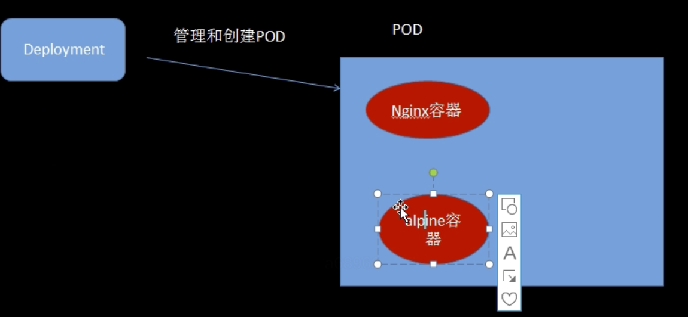

# Deployment


## deployment与pod区别


Pod


1. 运行一组容器，适合一次性开发
2. 很少直接用于生产


Deployment


1. 运行一组相同的pod（副本水平扩展），滚动更新
2. 适合生产


总结为： Deployment 通过副本集管理和创建POD


## 创建一个deployment


```bash
apiVersion: apps/v1
kind: Deployment
metadata:
    name: myngx
spec:
    selector:
        matchLabels:
            app: nginx
    replicas: 1
    template:
        metadata:
            labels:
                app: nginx
        spec:
            containers:
                - name: ngx
                  image: "nginx:1.18-alpine"
                  imagePullPolicy: IfNotPresent
```


```bash
$> kubectl apply -f xxx.yaml
# deployment.apps/myngx created
```


## 两个容器共享文件夹


```bash
apiVersion: apps/v1
kind: Deployment
metadata:
    name: myngx
spec:
    selector:
        matchLabels:
            app: nginx
    replicas: 1
    template:
        metadata:
            labels:
                app: nginx
        spec:
            containers:
                - name: ngx
                  image: "nginx:1.18-alpine"
                  imagePullPolicy: IfNotPresent
                - name: alpine
                  image: "alpine:3.12"
                  imagePullPolicy: IfNotPresent  # 只有当本地没有时，才下载镜像
                  command: ["/bin/sh"]
                  args: ["-c", "while true; do echo 'hello world'; sleep 10;done"]

```


关键点：


```bash

```


当设置empthDir时，同一个pod内的容器都能读写EmptyDir 中文件，常用于临时空间，多容器共享，如日志或者tmp 文件需要的临时目录；（譬如常用于ngxin 或者自定义程序来 输出一些日志，然后给到另一个容器来使用，这种模式就叫做 sideCar；





