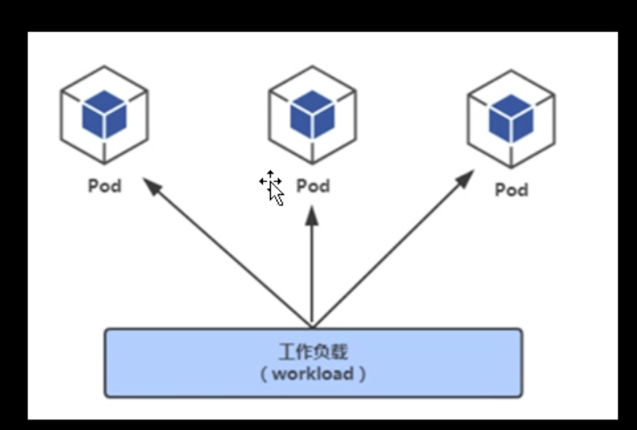
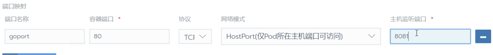
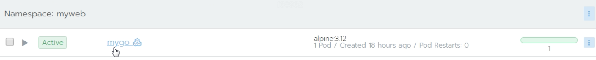
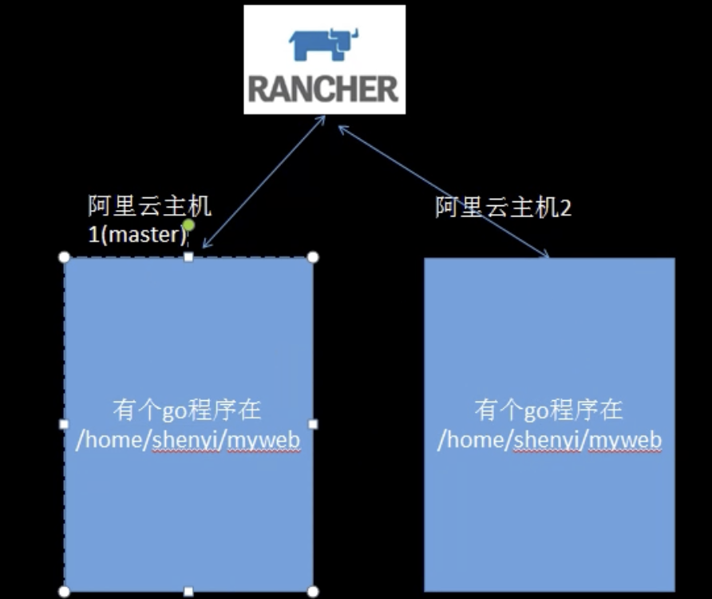
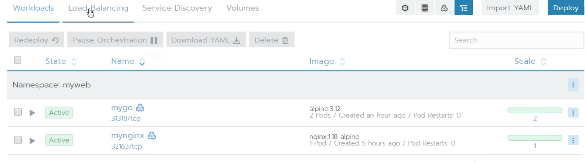
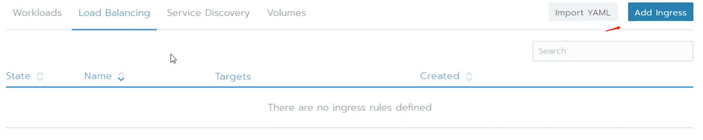
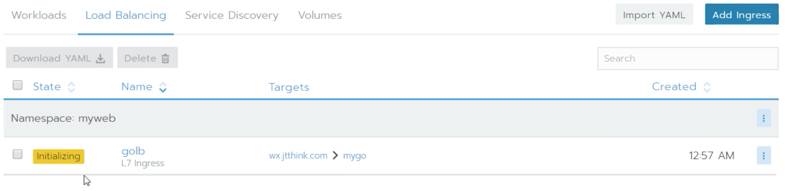
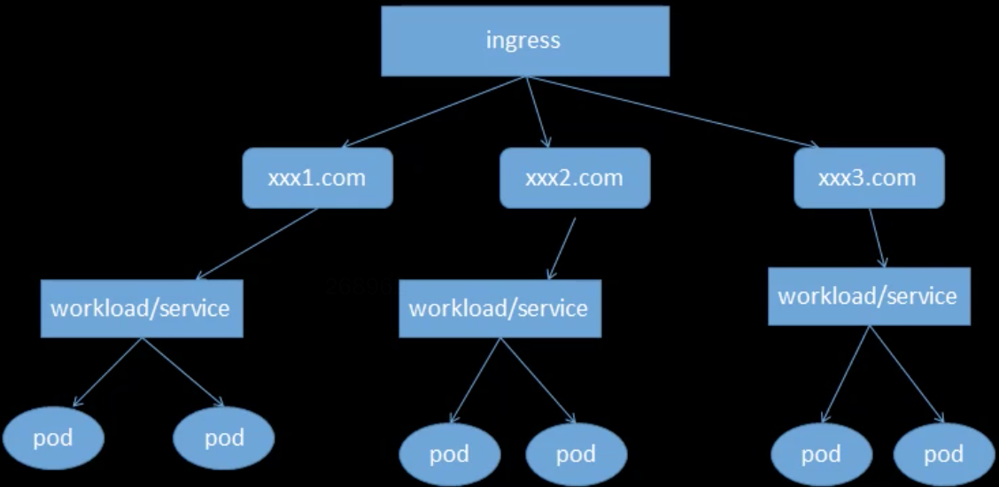
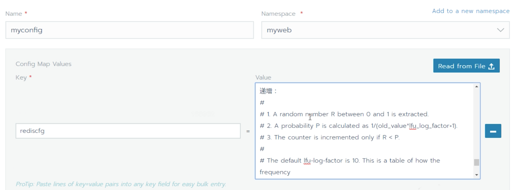

# 概念


## namespace

> Namespace 是对一组资源和对象的抽象集合，用来将系统内部的对象划分为不同的项目组或者用户组
>
> 它根linux的namespace属于不同层面的东西；
>
> namespace常用来隔离不同的用户，比如k8s自带的服务一般运行在kube-system namespace中；而不至于和用户自有的服务混淆；


## workload

pod是所有业务类型的基础，也是k8s管理的最小单位级；

可以理解它是一个或多个容器的组合；





### port的四种模式


#### NodePort 

>  (On every node), 所有主机（node，虚拟机）端口均可访问


在所有节点（虚拟机）上开发一个特定端口，任何发送到该端口的流量都被转发到对应的服务；

端口范围30000-32767 （指定或者随机生成）


```md
curl 172.17.70.144:32163
# success
curl 172.17.70:145:32163
# success
```


#### HostNode 

>  (Nodes running o pad) 仅pod所在主机（node，虚拟机）端口可访问


hostPort 直接将容器的端口与所调度的节点（虚拟机）上的端口进行映射




很类似那面这种，将容器ip和虚拟机ip映射上

```md
docker run -d --name tt\
-v /home/xxx/myweb:/app \
-w /app  \
-p 8081:80\
alpine:3.12\
./myserver
```


#### Cluster Ip 

>  (internal only)  集群内部访问
>
>  创建集群内的服务，应用只要在集群内都可以访问，外部（如公网）无法访问它；


这个服务如果不是想对外访问，譬如一些子api并不需要对外暴露，只需要互相之间调用；这时候选择Cluster IP即可；




此时mygo这个服务，k8s外部是无法访问的；


* 服务发现简单机制

Rancher2.4 使用k8s-coredns 作为服务发现基础

在同一个命名空间内：

​	可以通过service_name 直接解析

不同命名空间内容

​	service_name.namespace_name


#### Layer-4 Load Balancer

> L4层负载均衡器（对接公有云负载均衡服务）


## ingress

部署两个服务，并使用负载均衡配置；




两个程序，在两个主机上同时存在；一模一样的目录；




* 添加ingress






xxx.com -> success


### 负载均衡 -> add Ingress

> ingress是k8s暴露外部服务的基本方式，

* Ingress 相当于一个7层负载均衡器，理解为进行反代并定义规则的一个api对象， 
* ingress Controller 通过监听 ingress api转化为各自的配置 （常用的有 nginx-ingress， trafik-ingress）




不同域名访问ingress 时，可以代理到不同的workload中去；


## nfs

> Network File System

通过网络，让不同的机器、不同的操作系统可以共享彼此的文件；解决多个pod里面共用同一种资源的场景；


## ConfigMap

> 使用ConfigMap 挂载Redis配置文件





myconfig里面可以放很多key， key自己取名，value对应的是一个配置文件里面所有的内容；


## curl


```md
curl -H "Authorization:Bearer k8s" https://ai_dev:8443/api/v1/namespaces --insecure
```


* 访问services


```md
curl -H "Authorization:Bearer k8s" https://ai_dev:8443/api/v1/namespaces/aigc/services --insecure
```


