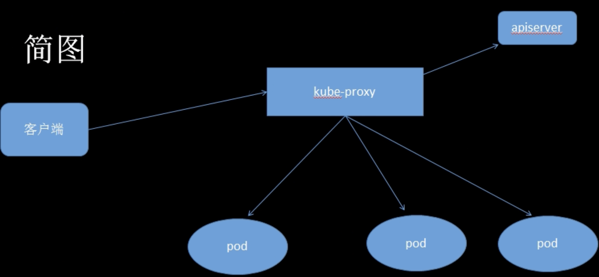

# kubectl


> kubectl 是k8s集群的命令行工具，通过kubectl能够对集群本身进行管理，并能够在集群上进行容器化应用的安装部署；


## install


下载地址:

GitHub.com/kubernetes/blob/master/CHANGELOG/CHANGELOG-1.24.md


### install

1. 把解压出来的kubectl移动到/usr/local/bin里面，或者任意在“环境变量”中且你喜欢的目录
2. chmod+x kubectl 
3. 执行kubectl version 看到版本代表安装成功；


kubectl

负责master和节点之间的通信，交互和数据上报到master的apiserver


整体来讲，它的职责为

1. Node管理
2. pod管理
3. 容器健康检查
4. 容器监控
5. 资源清理
6. 和容器运行时交互（docker，rkt，virtlet等）


## 10250端口

> 一般情况，kubectl会暴露10250端口，用于和apiserver交互 常用的查询API


GET

* /pods
* /stats/summary
* /metrics
* /healthz


## kube-proxy


外部通过NodePort， clusterIP等方式访问服务；

kube-proxy 运行在每个Node上，负责Pod网络代理，维护网络规则和四层负载均衡工作；





```bash
kubectl describe svc mygo -n myweb

./kc --kubeconfig dev.yaml  describe svc  serviceName  -n 
xiaoch

Name:              xc-web
Namespace:         xiaochu
Labels:            <none>
Annotations:       <none>
Selector:          app=xiaoch
Type:              ClusterIP
IP Family Policy:  SingleStack
IP Families:       IPv4
IP:                10.43.151.31  # 可通过curl 访问
IPs:               10.00.000.111
Port:              <unset>  80/TCP
TargetPort:        80/TCP
Endpoints:         10.42.0.72：80， 10.42.1.19：80 # 端点
Session Affinity:  None
Events:            <none>
```


当curl IP（10.43.151.31）时，请求会转发到 endpoints上的其中一个，

（10.42.0.72：80 或 10.42.1.19：80）
