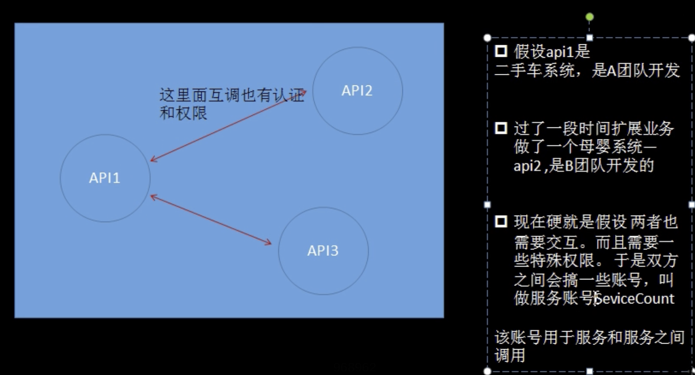
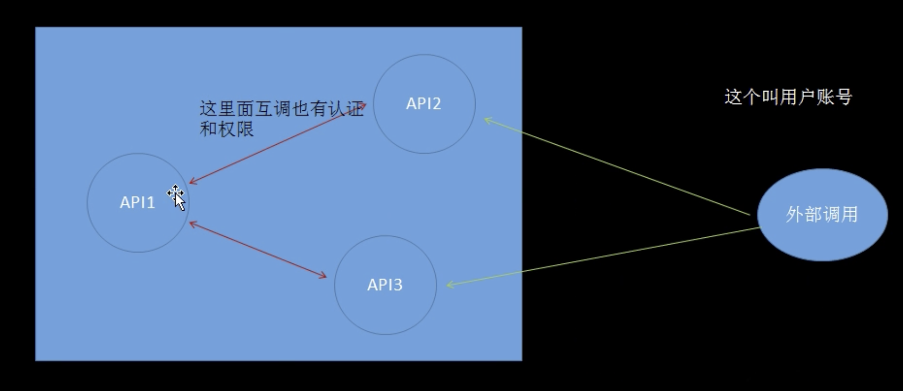

# 权限体系


当执行`kubectl get pods -n xxx` kubectl时，其实已经将 权限 带过去了；


```bash
cat ~/.kube/config

users
- name: kubernetes-admin # admin用户
```


## 用户账号与服务账号services的区别








## K8s里两种账户类型


UserCount --- 用户账号


也就是集群外部 访问时 使用的用户。最常见的就是kubectl 命令就是作为 kubernets-admin 用户来执行，k8s本身不记录这些账号；


