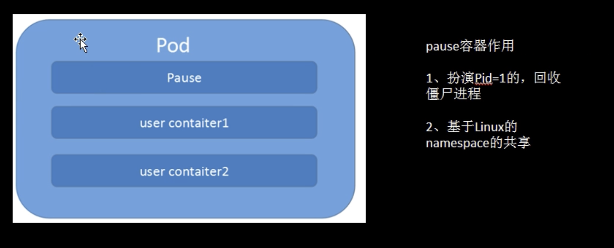
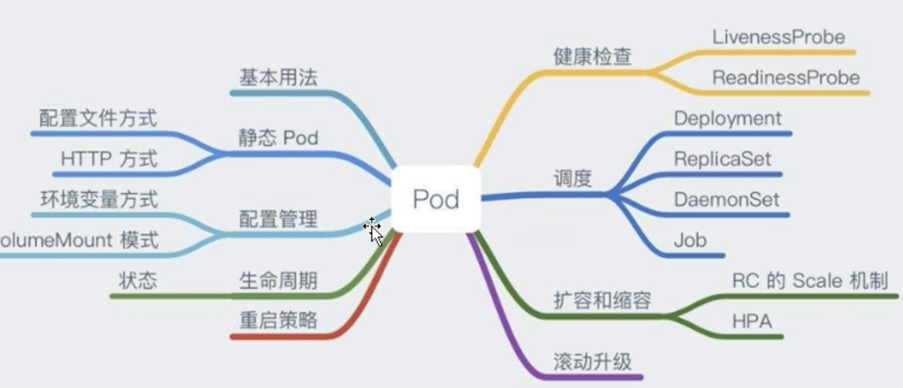
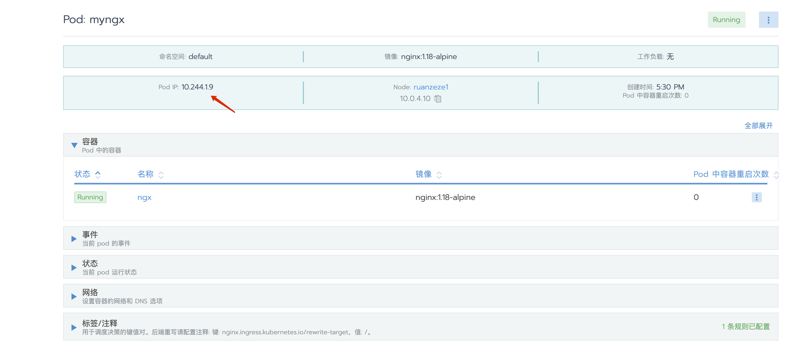

# pod





Pod 里面包含至少一个 Pause容器；

该容器是 Pid=1 的元老进程，负责回收一些僵尸进程；

基于Linux的namespace 共享





## 创建一个pod


```bash
kubectl get pods
vim mynginx.yaml

kubectl apply -f mynginx.yaml
```





```bash
curl 10.244.1.9  # 访问nodeIp
返回结果 index.html 
```


## 查看pod详情


```bash
kubectl describe pod myngx # myngx pod名
```


## 查看pod日志

```bash
kubectl logs  
```


## 进入pod的bash

```bash
kubectl exec -it myngx  -- sh
ctrl+D 退出 sh
```


## 创建一个多容器的pod


```bash
apiVersion: v1
kind: Pod
metadata:
  name: myngx
spec:
  containers:
    - name: ngx
      image: "nginx:1.18-alpine"
    - name: alpine
      command: ["sh", "-c", "while true; do echo 'hello world'; sleep 1; done"]
      image: "alpine:3.12"
```


```bash
kubectl exec -it myngx -c alpine -- sh
```


## 删除一个pod


```bash
kubectl delete pod myngx
```


