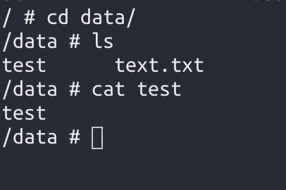

# 挂载


* 基本格式


```bash
spec:
  containers:
    - name: ngx
      image: "nginx:1.18-alpine"
      volumeMounts:     # 添加挂载
      - name: mydata
        mountPath: /data1   # 挂载到什么地方， /data1 容器里面的路径
```


## hostPath


hostPath卷 能将主机节点 文件系统上的文件或目录 挂载到 pod中；


```bash
apiVersion: v1
kind: Pod
metadata:
  name: myngx
spec:
  containers:
    - name: ngx
      image: "nginx:1.18-alpine"
      volumeMounts:
        - name: mydata
          mountPath: /data
    - name: alpine
      command: ["sh", "-c", "while true; do echo 'hello world'; sleep 1; done"]
      image: "alpine:3.12"
  volumes:
   - name: mydata
     hostPath:
       path: /root/home/data   # 这里需要填写 node上 实际的文件地址
       type: Directory      # 卷类型
```


* 进入pod进行验证

```bash
kubectl exec -it myngx -c ngx -- sh
```


进入 pod 发现，确实挂载上了 虚拟机节点上面的 data 文件夹；


我们改了 虚拟机节点上的data 内容 ，在看是否在pod里面生效了；




结果验证确实是如此；


* 一个坑点

我们发现 当进入 alpine 容器时， 并没有发现 /data，也就是说没挂载上 data；

解决方案看： Pod 和 Deployment 两个容器共享文件夹；


